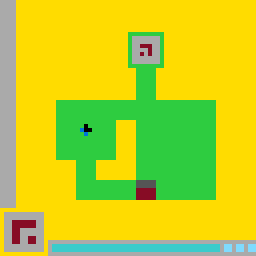

# Virgil LS20 result card

## Claim

On 2026-07-19, a clean snapshot of the private Virgil research repository
completed level 0 of the public ARC-AGI-3 environment `ls20-9607627b` in a
fresh run. The run used 60 survey actions followed by 16 actions emitted from
an internal world-model plan. The level counter advanced from 0 to 1 on action
76.

The source snapshot is committed as
`9f132995c21d852c3ba0915aab425eb7a7ffcdfc`. The run used
`arc-agi==0.9.9` and seed `1729`.

## Evidence

- [`manifest.json`](../evidence/virgil-ls20-v1/manifest.json) records the
  environment, package version, source commit, action counts, scope, and
  artifact checksums.
- [`trace.jsonl`](../evidence/virgil-ls20-v1/trace.jsonl) contains the emitted
  actions, phase labels, observed-frame hashes, and observed level counter.
- [`replay_trace.py`](../evidence/virgil-ls20-v1/replay_trace.py) replays the
  action sequence against the official public environment and checks every
  observed-frame hash and the final level transition.

The repository test suite also checks that the trace is sequential,
hash-chained, internally consistent with the manifest, and ends on the claimed
level transition.

## Scope and limitations

This demonstrates one real-game level completion and a concrete boundary
between survey actions and actions emitted from an internal model plan.

It does not demonstrate autonomous world-model induction, cross-game
generalization, broad ARC-AGI-3 performance, or a leaderboard result. The
provisional LS20 world model was hand-authored from recorded interaction
evidence. The private model, planner, verifier, and agent orchestration are not
published here.

The public trace can prove that the action sequence reproduces the observed
run. Without the private implementation, it cannot independently prove how
that sequence was generated. The phase and provenance claims are therefore an
auditable research record, not full algorithmic reproducibility.
